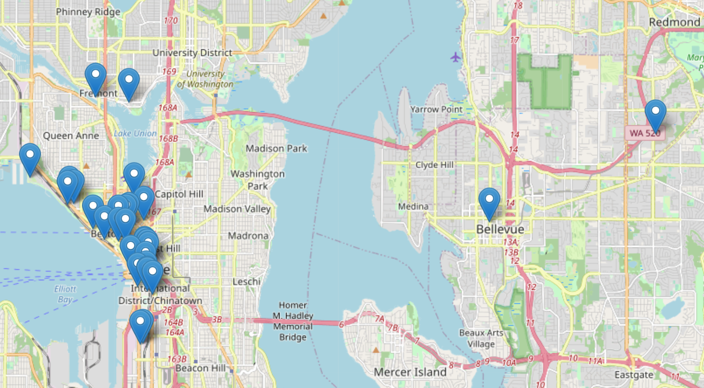
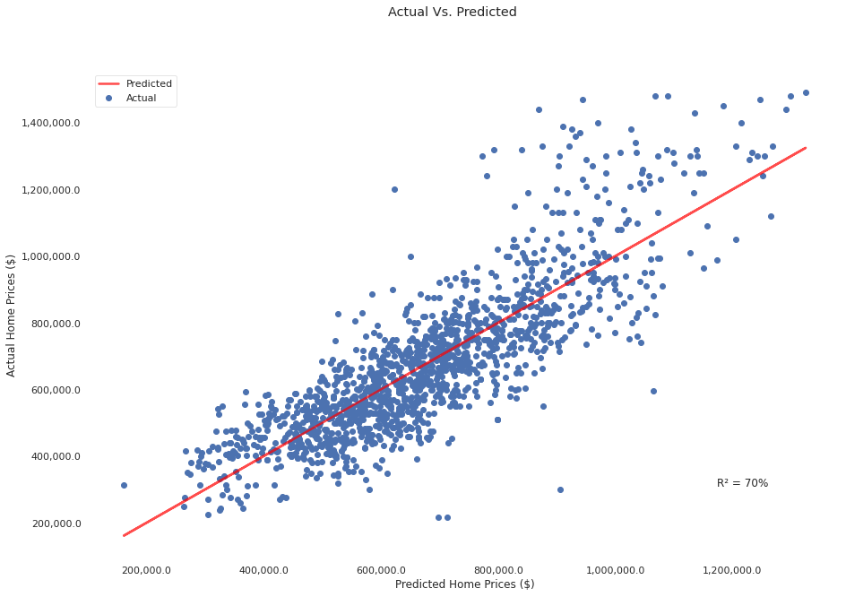
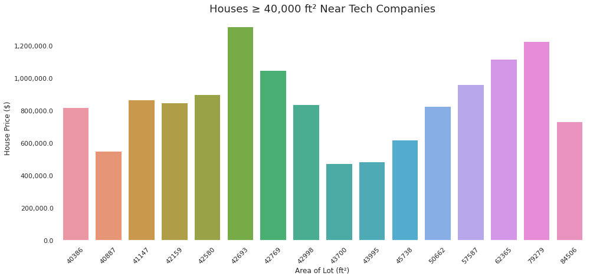

# Dwell Development 

**Authors**: Stefano Caruso, Holly Gultiano, Raul Torres

## Overview

We are analising King County data in order to provide a succesful business plan for Dwell Development. Dwell Development is an award-winning sustainable home builder in Seattle focusing on modern, energy efficient, net zero ready homes. Dwell Development is not a real estate company so they are going to use our work in order to analyse the best place to build for young families moving into the cities that want to work near prominent technology companies. The work is going to consist of using multiple linear regression modeling to analyze house sales. We are also going to compare different variables in order to find the strongest correlation.  

## Business and Data Understanding

Dwell Development wants to be able to make a profit from the large influx of people moving to Seattle for tech jobs. They want to be able to develop multi family properties but they do not know the best areas and which qualities correlate more to each other. There are a lot of variables but they only want to focus on the features that correlate strongest to price. We are going to fun simple and multi regression models in order to find the soltion so that Dwell Development does not waist resources in variables that are going to correlate strongly to sell price. 

Our housing data csv is located in the data folder on this repository. It is a csv file of house data from the King County area of Washington State. 

For our analysis, we used the "price" variable as the main target for our analysis.

This map shows the where the 30 most prominent tech companies are in Seattle. 



## Modeling

To look for what features in our dataset correlate the most with house pricing in the zip codes associated with local tech companies, we ran a few simple (one variable) linear regression models using Ordinary Least Squares, in order to find the best-fit features, then we created a multiple linear regression model with house price as our target and all the best-fit feature variables (see above) as our source. We chose these features because they showed the highest correlation to house price, showing the optimal choices based on statistical measures such as R² and the Durbin-Watson test.


## Regression Results

Our best fit model is better than the baseline model. The reason for this is because the R² result for the first one is 0.450, compared to our best fit model with an R² of 0.704. As well, the Durbin-Watson (1.958, with 2 being the ideal) is more positively correlated in our best fit model than the baseline model (Durbin-Watson 2.024). We found that the three variables with the highest correlation to sale price were True Ft squared, Construction Grade and Bedrooms.

If this model were to be put to use, Dwell Development will see an increase in business because they are not going to have to use reasources in areas that they don't need



## Conclusion
There were three features had the strongest impact on house price: true square feet (ft² living area - ft² basement), construction grade, and the number of bedrooms. Given this information, Dwell Development will have measureable data to optimize sale price and profit from their future multi-family home construction.

One limitation to our model was the fairly significant multicolinearity of some of our features. This was seemingly unavoidable due to the inherantly coupled nature of some aspects of houses, i.e., if more bedrooms are added, it is almost always true that more bathrooms would be too, or more floors and living space to accommodate them. We hope to find any possible workarounds to this limitation going forward.

Another factor to consider was the age of the data available. The data available to us went up to the year 2015. House prices have fluctuated a lot in the past few years, especially due to the pandemic's effects on the economy. For future analysis, we would like to mine recent and relevant data and explore trends in pricing over time.




## Repository Structure

```
├── Data                               <- Collection of provided data.
├── development-notebooks              <- Narrative documentation of analysis in Jupyter notebook.
├── images                             <- Images used in PDF and README.
├── .gitignore                         <- Rules to ignore by Github.
├── README.md                          <- This file.
└── green-housing-dev-analysis.ipynb   <- Jupyter Notebook containing exploration and analysis of our data.
```
